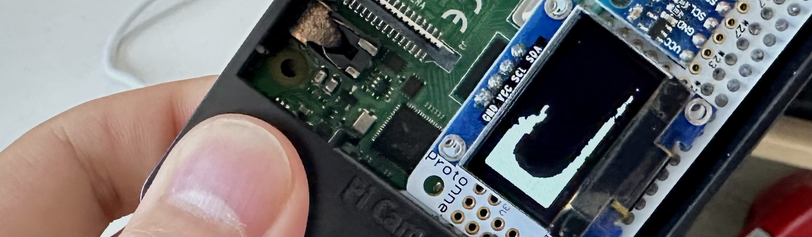

# pi-sph-fluid



This project uses an SSD1306 OLED module, an MPU6050 accelerometer, and a Raspberry Pi 4 to realize a fluid simulation toy that lets you toss around an ocean of water in your hand. (That is, it simulates fluid dynamics at a scale larger than the actual screen.) You can see it in action on [Youtube](https://youtu.be/6_YntT-Zha0). This can be thought of as a "free-surface flow" problem, and it's solved by a "smoothed particle hydrodynamics" (SPH) technique.

## Running

The only dependencies are OpenMP and the [ssd1306](https://github.com/lexus2k/ssd1306) driver by lexus2k. Thanks to the SDL emulation of the SSD1306 offered by the ssd1306 library, this project offers a choice of two executables: `desktop_sph_fluid` and `pi_sph_fluid`.

1. `desktop_sph_fluid` generates and renders a circular drop falling on a dry surface, and it can be compiled (on Linux) with the commands

```bash
git clone https://github.com/colonelwatch/pi-sph-fluid
cd pi-sph-fluid
git submodule update --init ssd1306
make desktop_sph_fluid

./desktop_sph_fluid
```

2. `pi_sph_fluid` generates the same but with gravity determined by reading the MPU6050 accelerometer. I2C and the driver for accelerometer need to be enabled by configuring `/boot/config.txt`. All the necessary commands are

```bash
sudo apt install git

# configure /boot/config.txt (you can also write these lines in manually)
sudo raspi-config nonint do_i2c 0 # call raspi-config non-interactively for turning on i2c correctly
sudo raspi-config nonint set_config_var dtparam=i2c_arm on,1000000 /boot/config.txt # set i2c speed to 1MHz
echo dtoverlay=mpu6050 | sudo tee -a /boot/config.txt # pull up device tree overlay for mpu6050
sudo reboot

git clone https://github.com/colonelwatch/pi-sph-fluid
cd pi-sph-fluid
git submodule update --init ssd1306
make pi_sph_fluid

# limit the rate at which the MPU6050 is being polled
echo 10 | sudo tee /sys/bus/iio/devices/iio:device0/sampling_frequency

./pi_sph_fluid
```

## What's implemented?

Besides the ssd1306 driver, this project is just under 750 lines of C! Here's what this project implements in that many lines:

1. Linked-list neighbors search, a common technique but outlined well in [1]
2. Weakly-compressible smoothed particle hydrodynamics (WCSPH), completely described in [2] and [3]
    * Artificial viscosity and momentum-preserving pressure, described in the same
    * Ordinary advection (not XSPH)
    * Working around negative density error by clamping negative pressure to zero, mentioned in the IISPH, DFSPH, and PBF papers ([4-6] respectively) along with other papers
3. Boundary handling offered by [7]
4. Fake surface tension effects using artificial pressure, mentioned in [6]
5. Rendering using metaballs, following the original implementation in [8]
6. OpenMP acceleration

To be exact: expect a writeup on this or even some cleaning up, but the following equations are implemented.

### Wendland C2

Given two-dimensional coordinates written as $\vec{x}_i = (x_i, y_i)$, the two-dimensional Wendland C2 kernel found in [9]:

```math
W(\vec{x}_i - \vec{x}_j, h) = \begin{cases} \frac{7}{4 \pi h^2} (1 - 0.5 q)^4 (1 + 2 q) & q < 2 \\ 0 & q \geq 2 \end{cases}
```

```math
\frac{d W}{d q} = \begin{cases} \frac{7}{4 \pi h^2} (-5 q) (1 - 0.5 q)^3 & q < 2 \\ 0 & q \geq 2 \end{cases}
```

where $q = \left\Vert \vec{x}_i - \vec{x}_j \right\Vert / h$, and the derivatives $dW/dx_i$ and $dW/dy_i$ found by the chain rule

```math
\frac{dW}{dx_i} = \frac{dW}{dq} \frac{dq}{dx_i} = \left( \frac{dW}{dq} \right) \left( \frac{x_i - x_j}{\left\Vert \vec{x}_i - \vec{x}_j \right\Vert h} \right)
```

```math
\frac{dW}{dy_i} = \frac{dW}{dq} \frac{dq}{dy_i} = \left( \frac{dW}{dq} \right) \left( \frac{y_i - y_j}{\left\Vert \vec{x}_i - \vec{x}_j \right\Vert h} \right)
```

Also note:
* $`W(\vec{x}_i - \vec{x}_j, h)`$ is typically rewritten as $`W_{i j}`$
* The typical expression of the gradient can be rewritten in terms of the above as

```math
\nabla_i W_{i j} = \left( \frac{d W}{d x_i} , \frac{d W}{d y_i} \right)
```

### Boundary using rigid particles

The pseudo-mass of which is defined in [7]:

```math
\psi_{b_i} = \frac{\rho_0}{\sum_{b_j} W_{b_i b_j}}
```

where $\rho_0 = 1000$ is the reference fluid density

### Fluid density with rigid correction

Found in [7]:

```math
\rho_{f_i} = m_{f_i} W ( \vec{0} ) + \sum_{f_j} m_{f_j} W_{f_i f_j} + \sum_{b_j} \psi_{b_j} W_{f_i b_j}
```

Also note:
* Calculating the density seems to be the one exception where a particle can neighbor itself (see [calculation of density in SPlisHSPlasH](https://github.com/InteractiveComputerGraphics/SPlisHSPlasH/blob/a081124afab372a90c1d1848d4b85ea58b8dcadb/SPlisHSPlasH/TimeStep.cpp#L162-L171))
    * However, a particle doesn't seem to neighbor itself in the general case (see the [comparison against brute-force search](https://github.com/InteractiveComputerGraphics/CompactNSearch/blob/99fa1fe052f353b33957948f36e628500f1737f7/demo/main.cpp#L66-L67) in the neighbors search library used in SPlisHSPlasH)
* Here, the self-contribution is written out as an explicit term
* This may or may not be the interpretation taken in [7] as well

### WCSPH explicit pressure

Stated first in the context of fluid simulation with SPH in [2], plus the clamping at zero (as employed in incompressible SPH formulations in [4, 5]) used as a hack:

```math
p_{f_i} = \begin{cases} \frac{c_0^2 \rho_0}{7} \left( \left( \frac{\rho_{f_i}}{\rho_0} \right)^7 - 1 \right) & \rho_{f_i} > \rho_0 \\ 0 & \rho_{f_i} \leq \rho_0 \end{cases}
```

where $c_0 = 400$ is the numerical speed of sound (see [2] or [3]) and $\rho_0 = 1000$ is the reference fluid density

### Acceleration

Including momentum-preserving pressure gradient from [2], artificial viscosity from [2], and artificial pressure from [6], and rigid correction from [7]:

```math
\begin{align*} \frac{d \vec{v}_i}{dt} & = - \sum_{f_j} m_{f_j} \left( \frac{p_{f_i}}{\rho_{f_i}^2} + \frac{p_{f_j}}{\rho_{f_j}^2} + \Pi_{{f_i} {f_j}} + s_{f_i f_j} \right) \nabla_{f_i} W_{f_i f_j} \\ & \qquad -\sum_{b_j} \psi_{b_j} \left( \frac{p_{f_i}}{\rho_{f_i}^2} + \Pi_{f_i b_j} + s_{f_i b_j} \right) \nabla_{f_i} W_{f_i b_j} \\ & \qquad + \vec{g} \end{align*}
```

where $\vec{g}$ is gravitational acceleration, and the artificial viscosities (original and corrected) being

```math
\Pi_{f_i f_j} = \begin{cases} -\frac{\alpha c_0}{\bar{\rho}_{f_i f_j}} \frac{h \, \vec{x}_{f_i f_j} \cdot \vec{v}_{f_i f_j}}{\left\Vert \vec{x}_{f_i f_j} \right\Vert^2 + \epsilon h^2} & \vec{x}_{f_i f_j} \cdot \vec{v}_{f_i f_j} \leq 0 \\ 0 & \vec{x}_{f_i f_j} \cdot \vec{v}_{f_i f_j} > 0 \end{cases}
```

```math
\Pi_{f_i b_j} = \begin{cases} -\frac{\alpha c_0}{\rho_{f_i}} \frac{h \, \vec{x}_{f_i b_j} \cdot \vec{v}_{f_i b_j}}{\left\Vert \vec{x}_{f_i b_j} \right\Vert^2 + \epsilon h^2} & \vec{x}_{f_i b_j} \cdot \vec{v}_{f_i b_j} \leq 0 \\ 0 & \vec{x}_{f_i b_j} \cdot \vec{v}_{f_i b_j} > 0 \end{cases}
```

where $\alpha=0.01$ and $\epsilon=0.01$, and the artifical pressure being

```math
s_{i j} = k_1 \left( \frac{W_{i j}}{W(k_2 h \, \vec{e})} \right)^4
```

where $k_1 = 0.1$, $k_2 = 0.2$, and $\vec{e}$ is just a unit-length vector

Also note:
* The mean rho is written as $\bar\rho_{f_i f_j} = (\rho_{f_i} + \rho_{f_j})/2$
* The position difference is written as $\vec{x}_{i j} = \vec{x}_i - \vec{x}_j$
* The velocity difference is written as $\vec{v}_{i j} = \vec{v}_i - \vec{v}_j$

### Metaballs rendering

Given $\vec{x}_{p_i}$ is the center of a pixel and $\Delta x_p$ is the width of a pixel in the domain, metaballs rendering:

```math
g(\vec{x}_{p_i}) = \sum_{f_j} \frac{W_{p_i f_j}}{W(0.5 \, \Delta x_p \,\, \vec{e})}
```

where $\vec{e}$ is just a unit length vector and pixel $p_i$ should light up if $g(\vec{x}_{p_i}) \geq 1$

### Leapfrog integration

```math
\begin{align*} \vec{v}_{i+1/2} & = v_i + 0.5 \, \Delta t \left. \frac{d \vec{v}}{d t} \right\rvert_{\vec{x}_i} \\ \vec{x}_{i+1} & = x_i + \Delta t \, \vec{v}_{i + 1/2} \\ \vec{v}_{i+1} & = v_{i+1/2} + 0.5 \, \Delta t \left. \frac{d \vec{v}}{d t} \right\rvert_{\vec{x}_{i+1}} \end{align*}
```

## What's not implemented?

This project really sits on the ground floor of SPH, and some next steps include:

1. Z-order or some other -order sort of particles for a higher cache hit rate, as described in [1]
    * Ideally, this sort should be multithreaded
2. Inferring velocity from accelerations taken from the MPU6050 and assigning that velocity to the boundary
    * This would add a bit more realism to the fluid simulation
3. GPU acceleration or an implementation of one of the incompressible schemes (PCISPH, IISPH, DFSPH, PBF, etc)
    * There's a failed attempt at IISPH in the `IISPH` branch
    * Some of the most interesting fluid phenomena don't arise in the small number of particles that CPU WCSPH can handle without going unstable (currently 431)

## References

[1] J. M. Domínguez, A. J. C. Crespo, M. Gómez-Gesteira, and J. C. Marongiu, “Neighbour lists in smoothed particle hydrodynamics,” International Journal for Numerical Methods in Fluids, vol. 67, no. 12, pp. 2026–2042, 2011, doi: 10.1002/fld.2481.

[2] J. J. Monaghan, “Smoothed particle hydrodynamics,” Reports on progress in physics, vol. 68, no. 8, p. 1703, 2005.

[3] J. J. Monaghan, “Simulating Free Surface Flows with SPH,” Journal of Computational Physics, vol. 110, no. 2, pp. 399–406, 1994, doi: 10.1006/jcph.1994.1034.

[4] M. Ihmsen, J. Cornelis, B. Solenthaler, C. Horvath, and M. Teschner, “Implicit Incompressible SPH,” IEEE Transactions on Visualization and Computer Graphics, vol. 20, no. 3, pp. 426–435, Mar. 2014, doi: 10.1109/TVCG.2013.105.

[5] J. Bender and D. Koschier, “Divergence-free smoothed particle hydrodynamics,” in Proceedings of the 14th ACM SIGGRAPH / Eurographics Symposium on Computer Animation, Los Angeles California: ACM, Aug. 2015, pp. 147–155. doi: 10.1145/2786784.2786796.

[6] M. Macklin and M. Müller, “Position based fluids,” ACM Trans. Graph., vol. 32, no. 4, pp. 1–12, Jul. 2013, doi: 10.1145/2461912.2461984.

[7] N. Akinci, M. Ihmsen, G. Akinci, B. Solenthaler, and M. Teschner, “Versatile rigid-fluid coupling for incompressible SPH,” ACM Trans. Graph., vol. 31, no. 4, pp. 1–8, Aug. 2012, doi: 10.1145/2185520.2185558.

[8] J. F. Blinn, “A Generalization of Algebraic Surface Drawing,” ACM Trans. Graph., vol. 1, no. 3, pp. 235–256, Jul. 1982, doi: 10.1145/357306.357310.

[9] D. Violeau, Fluid mechanics and the SPH method: theory and applications. Oxford University Press, 2012.

[10] J. J. Monaghan, “SPH without a tensile instability,” Journal of computational physics, vol. 159, no. 2, pp. 290–311, 2000.
